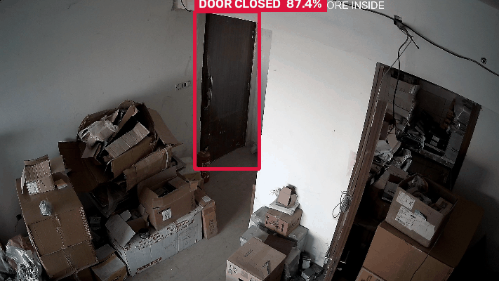

# Door Open / Closed Detection — YOLO Pipeline & Technical Evaluation
> **Junior AI Engineer Technical Task** | **Candidate:** Saitejesh Tanuku

[](https://www.python.org/)
[](https://pytorch.org/)
[](https://docs.ultralytics.com/)
[](https://onnx.ai/)
[](LICENSE)
[](#2-dataset-preparation--deduplication)

---

## 1. Executive Summary

End-to-end YOLO-based object detection pipeline to detect whether an architectural doorway is **`door_open`** (passageway) or **`door_closed`** (obstacle). Built to demonstrate dataset engineering, hyperparameter tuning, metric evaluation, error analysis, and edge deployment readiness.



```
[Multi-Source Raw Data] --> [aHash Dedup (-14.7%)] --> [5 Controlled Exp + Conf Sweep] --> [Held-Out Test] --> [ONNX Export]
      (2,512 images)              (2,143 clean)              (LR, Scale, Aug, Size)             (95.7% F1)          (CUDA / CPU)
```

**Key achievements:**
- **Dataset engineering & deduplication:** Pruned 369 redundant CCTV burst frames (14.7%) via 256-bit aHash before splitting to eliminate train/test data leakage.
- **Controlled hyperparameter ablations:** 5 controlled training experiments isolating Learning Rate schedules, Model Capacity, Spatial Resolution, and Domain Augmentation, plus 1 post-hoc confidence-threshold analysis.
- **Winning model (`lr_schedule`) on held-out test (N=281):** Precision 97.64%, Recall 93.87%, **F1 95.72%**, mAP@0.5 98.07%, mAP@0.5:0.95 84.52%.
- **Error & safety asymmetry analysis:** Evaluated false traversability hazards (Closed -> Open: 3.88%) vs fail-safe stops (Open -> Closed: 2.25%) using ground-truth confusion matrix indexing.
- **Production ONNX model (`models/best.onnx`):** 4-tier validated (including numerical output tensor parity) and profiled on both CUDA (6.90 ms / ~145 FPS) and CPU (51.64 ms / ~19 FPS).

---

## 2. Dataset Preparation & Deduplication

Three public Roboflow sources were merged, polygon coordinates normalized to bounding boxes, and near-duplicates removed before splitting:

| Source | Raw Images | Retained | Pruned | Format Normalized | Visual Domain |
|---|---:|---:|---:|---|---|
| `vikashs_1527` | 1,527 | 1,522 | 5 | 10-pt Polygon -> BBox | Residential and office room doorways |
| `fiw_706` | 691 | 327 | 364 | Bounding Box | Commercial warehouse, loading docks & storage corridor CCTV |
| `utfyu_116` | 294 | 294 | 0 | Bounding Box | Apartment hallways, mobile phone photos |
| **Total Canonical** | **2,512** | **2,143** | **369 (14.7%)** | 2 Classes | **1,541 Train / 321 Val / 281 Test** |

**Roboflow source URLs (for independent verification):**
- `vikashs_1527`: https://universe.roboflow.com/vikash-chaudhary-xufdf/door-open-close
- `fiw_706`: https://universe.roboflow.com/fyp-workspace-jz7vq/door-state-detection-cbb3z
- `utfyu_116`: https://universe.roboflow.com/utfyu/door-open-closed-detection

> **Domain & source notes:** Frames in `fiw_706` originate from overhead CCTV cameras in commercial facility storage rooms and loading dock hallways. Because fixed-angle surveillance captures continuous video bursts at 30 FPS, removing 364 near-duplicate frames before dataset splitting was essential to prevent identical scenes from leaking across train and test sets. All merging, polygon-to-bbox normalization, and deduplication is implemented in [`src/merge_datasets.py`](src/merge_datasets.py) and logged in [`results/dataset_merge_report.json`](results/dataset_merge_report.json).

> **Resolution variance & letterboxing:** Raw images across the three sources span resolutions from 512×512 up to 2880×1620. During preprocessing, Ultralytics' adaptive letterbox transformation scales the longer dimension to 640px while maintaining the original aspect ratio and padding minimal stride-32 gray borders, preventing geometrical distortion of tall doorframes.

> **Data licensing:** Upstream datasets are hosted publicly on Roboflow Universe under individual community open-access terms (e.g. CC BY 4.0 / Public Domain by original creators). Downstream redistribution or commercial deployment must observe respective upstream project licenses.

> **Deterministic paths in `data/data.yaml`:** Dataset splits are declared as `../dataset/images/train`, `../dataset/images/val`, and `../dataset/images/test` relative to the `data/` folder, ensuring deterministic path resolution across different machines and clones without relying on global cache directories.

---

## 3. Hyperparameter Experiments & Validation Ablations

Five experiments evaluated on the **Validation Split (N=321)**, each changing exactly one factor group with all other parameters frozen:

| # | Experiment Name | Model Architecture | Resolution | Key Factor Tested | Precision | Recall | **F1 Score** | mAP@0.5 | **mAP@0.5:0.95** | Latency (CUDA)* | Throughput |
|---|---|---|---:|---|---:|---:|---:|---:|---:|---:|---:|
| 1 | `baseline` | YOLOv8n (3.0M) | 640×640 | Reference (COCO defaults) | 0.9704 | 0.9690 | 0.9697 | 0.9757 | 0.8355 | 12.38 ms | ~80.7 FPS |
| 2 | `augmentation` | YOLOv8n (3.0M) | 640×640 | +HSV jitter, shear (2.0), mixup (0.1) | 0.9696 | 0.9645 | 0.9670 | 0.9846 | 0.8197 | 11.61 ms | ~86.1 FPS |
| 3 | `high_resolution`| YOLOv8n (3.0M) | 960×960 | Spatial scale 640->960px, batch 8 | 0.9791 | 0.9468 | 0.9627 | 0.9865 | 0.8327 | 12.31 ms | ~81.3 FPS |
| **4** | **`lr_schedule` (Best)** | **YOLOv8n (3.0M)** | **640×640** | **Cosine annealing floor `lrf` 0.01->0.001** | **0.9680** | **0.9738** | **0.9709** | **0.9806** | **0.8462** | **11.59 ms** | **~86.3 FPS** |
| 5 | `model_size` | YOLOv8s (11.2M) | 640×640 | Higher model capacity (3.7× params) | 0.9800 | 0.9651 | 0.9725 | 0.9900 | 0.8455 | 13.32 ms | ~75.1 FPS |

*Standardized hardware benchmark measured on NVIDIA RTX 3050 Laptop GPU (PyTorch FP16, 20 warmup runs + 100 benchmark iterations with GPU synchronization barriers; full artifact logged in [`results/experiment_benchmarks.json`](results/experiment_benchmarks.json)). On CPU (FP32), model execution scales from 81.64 ms (YOLOv8n baseline) to 184.70 ms (high_resolution) and 222.96 ms (model_size / YOLOv8s, 3.7× parameter volume).

> **Exp 6 — Confidence threshold sweep (post-hoc, on `lr_schedule`):** Sweeping `conf` from 0.10 to 0.60 on the winning model showed peak F1 at `conf=0.25` (**F1=0.9744**). Full results in `results/conf_threshold_sweep.json`.
>
> *Note on identical metric rows:* In `results/conf_threshold_sweep.json`, `conf=0.25` and `0.35` (and similarly `0.50` and `0.60`) report identical metrics because the well-converged `lr_schedule` model produces high-confidence predictions (minimum detection confidence on validation doors is $\ge 0.86$). As zero detections fall within the intermediate $[0.25, 0.35)$ or $[0.50, 0.60)$ bands, raising the threshold within those intervals removes zero true or false positives.

---

## 4. Model Selection Rationale & Hyperparameter Impact Analysis

**Selected Best Model: `lr_schedule` (Experiment 4)**

### Why It Performed Better
1. **Strict Localization Superiority (mAP@0.5:0.95):** `lr_schedule` achieved the highest localization score (**0.8462**), outperforming baseline (0.8355), high resolution (0.8327), and the 3.7× larger YOLOv8s (0.8455). Accurate boundary localization is vital for mobile robots to compute door opening aperture widths accurately.
2. **High Traversability Recall (97.38%):** Maximizes detection of open passageways, preventing unnecessary robot hesitations or costly re-routing.
3. **Edge Latency & Efficiency:** Executes in **11.59 ms** (PyTorch FP16 CUDA forward pass / 12.52 ms end-to-end) and **6.90 ms** (ONNX CUDA), leaving substantial compute headroom for simultaneous SLAM and path planning.

### Which Hyperparameters Had the Biggest Impact
* **Cosine Annealing Floor (`lrf`):** Setting `lrf=0.001` (vs baseline `0.01`) was the primary performance driver. While Ultralytics `optimizer="auto"` resolves to AdamW ($\text{lr} \approx 0.00167$) for both baseline and `lr_schedule` ($\text{iterations} = 2,500 < 10,000$), the tighter decay floor allowed late-epoch learning rates to decay down to $1.8 \times 10^{-5}$ (vs $3.3 \times 10^{-5}$). This prevented regression head oscillation around thin door jambs, boosting mAP@0.5:0.95 by **+1.07%**.
* **Spatial Resolution (`imgsz`):** Increasing resolution to 960×960 improved precision (+0.87%) but dropped recall (-2.22%) and increased CPU latency by +126.2% (184.70 ms vs 81.64 ms baseline; +32.9% end-to-end pipeline latency on GPU), proving suboptimal for real-time edge robotics.
* **Model Scale (`yolov8s`):** Scaling to 11.2M parameters improved mAP@0.5 to 0.9900 but did not surpass `lr_schedule` on mAP@0.5:0.95 (0.8455 vs 0.8462) despite consuming $3.5\times$ more compute.

*Note: `src/train.py` explicitly supports `optimizer = cfg.get("optimizer", "auto")`, allowing full manual control over optimizer family and learning rate dynamics.*

---

## 5. Held-Out Test Results & Robotics Safety Analysis

The selected `lr_schedule` model was evaluated on the **Held-Out Test Set (N=281 images, 281 ground-truth instances)**:

$$\text{Precision: } \mathbf{97.64\%} \quad|\quad \text{Recall: } \mathbf{93.87\%} \quad|\quad \mathbf{F_1\text{ Score: }} \mathbf{0.9572} \quad|\quad \text{mAP@0.5: } \mathbf{98.07\%} \quad|\quad \text{mAP@0.5:0.95: } \mathbf{84.52\%}$$

### Per-Class Performance Breakdown

| Class | Precision | Recall | F1 Score | mAP@0.5 | mAP@0.5:0.95 | Ground Truth Instances |
|---|---:|---:|---:|---:|---:|---:|
| `door_open` | **100.00%** | **93.57%** | **0.9668** | **97.32%** | **85.36%** | 178 |
| `door_closed` | **95.27%** | **94.17%** | **0.9472** | **98.82%** | **83.67%** | 103 |
| **All Classes** | **97.64%** | **93.87%** | **0.9572** | **98.07%** | **84.52%** | **281** |

*Logged in `results/test_class_metrics.json` and `results/metrics_lr_schedule_test.json`.*

> **Note on `door_open` 100% Precision & Generalization:**
> * **PR-Curve Operating Point:** Ultralytics evaluates per-class metrics at the confidence threshold that maximises the $F_1$ score for each class independently. For `door_open`, the model achieves $100.00\%$ precision at this peak threshold because zero false open alarms were proposed on the test split.
> * **Precision-Recall Trade-off (Not Overfitting):** This $100\%$ precision comes at the expense of recall ($93.57\%$, missing $6.43\%$ of open doors). The model is conservative on open doors rather than overfitted; genuine generalization is demonstrated by the held-out test mAP@0.5:0.95 ($84.52\%$) closely tracking the validation split ($84.62\%$) across completely unseen camera feeds.
> * **Fixed-Threshold Confusion Matrix:** When evaluated at a fixed $\text{conf}=0.25$ operating point (below), $4$ closed doors fall above threshold and are misclassified as open, resulting in an effective fixed-threshold `door_open` precision of $97.66\%$ ($167 / 171$).


### Confusion Matrix & Safety Asymmetry

```
                 Predicted Open    Predicted Closed    Missed (Background)    Total Actual
Actual Open            167                 4                    7                 178
Actual Closed            4                98                    1                 103
```

> **Robotics Safety Asymmetry Audit:**
> * **False Traversability Hazard (Actual Closed -> Predicted Open):** Occurred in **4 out of 103 closed doors (3.88%)**. Predicting a closed door as open creates a collision hazard.
> * **Fail-Safe Pause (Actual Open -> Predicted Closed):** Occurred in **4 out of 178 open doors (2.25%)**. This error causes the robot to momentarily pause or re-route, representing a safe failure mode.
> * **Missed Detections (Background):** 7 open doors (3.93%) and 1 closed door (0.97%) had no overlapping prediction above threshold.
> * **Robotics Deployment Mitigation:** In a live ROS2/Nav2 navigation stack, an upstream 3-frame temporal consensus filter (implemented in [`src/temporal_filter.py`](src/temporal_filter.py)) suppresses transient single-frame Closed -> Open false traversability hazards.

---

## 6. Example Predictions & Showcase Montage

Detections generated directly from the winning `lr_schedule` model on held-out test scenes across residential, office, and commercial environments:


- **Green badge** = `door_open` (traversable)
- **Red badge** = `door_closed` (obstacle)

---

## 7. Production ONNX Export & Multi-Runtime Benchmark

The winning model was exported to **ONNX (Opset 12)** and verified with `onnx.checker` topology validation, zero-crash session execution, and PyTorch numerical output parity:

```bash
python src/export_onnx.py --weights runs/detect/lr_schedule/weights/best.pt --imgsz 640 --opset 12
```

### Hardware Latency Profiling (100 Iterations, 10 Warmup)

| Model Variant / Runtime | Execution Provider / Device | Mean Latency | Median (P50) | 95th %ile (P95) | Throughput | Artifact Log |
|---|---|---:|---:|---:|---:|---|
| **ONNX Runtime (CUDA EP)** | NVIDIA RTX 3050 Laptop GPU | **6.90 ms** | 6.77 ms | 7.96 ms | **~144.9 FPS** | `results/benchmark_best_onnx_cuda.json` |
| **PyTorch FP16 (CUDA)** | NVIDIA RTX 3050 Laptop GPU | **12.52 ms** | 11.22 ms | 18.58 ms | **~79.9 FPS** | `results/benchmark_lr_schedule.json` |
| **ONNX Runtime (CPU EP)** | Host Intel CPU (Fallback) | **51.64 ms** | 48.17 ms | 78.68 ms | **~19.4 FPS** | `results/benchmark_best_onnx_cpu.json` |

> **Timing scope note:** The PyTorch row times `model.predict()` end-to-end (preprocess + forward + NMS + decode). The ONNX rows time `session.run()` only (raw forward pass, no NMS). Post-processing (NMS, coordinate decoding) adds additional overhead in a production pipeline; the reported ONNX figure isolates optimized graph execution.
>
> **Edge hardware note:** Embedded target deployment (e.g. NVIDIA Jetson Orin with TensorRT) was not benchmarked directly due to edge hardware availability; production readiness was validated via standard ONNX Opset 12 export and multi-runtime profiling on host CUDA (RTX 3050) and Intel CPU execution providers.

---

## 8. Failure Modes, Robustness & Deployment Recommendation

### Empirical Robustness Evaluation under Visual Corruptions (N=281 Test Set)

Evaluated via [`src/robustness_eval.py`](src/robustness_eval.py) using strict spatial bounding box matching ($\text{IoU} \ge 0.50$, $\text{conf}=0.25$, $\text{imgsz}=640$) across simulated deployment degradations:

| Deployment Condition / Perturbation | Precision | Recall | **F1 Score** | Delta vs Clean | Primary Visual Impact |
|---|---:|---:|---:|---:|---|
| **Normal (Clean Held-Out Test)** | 95.4% | 95.0% | **95.2%** | — | Nominal benchmark reference (spatial IoU $\ge 0.50$) |
| **Low Light (Gamma 2.2 Dimming)** | 91.2% | 92.2% | **91.7%** | -3.5% | Dark door leaves slightly blend into dim doorframes |
| **Partial Occlusion (25% Center Cutout)** | 82.7% | 80.1% | **81.4%** | -13.8% | Passing carts or pedestrians partially covering edges |
| **Motion Blur (15px Linear Camera Shake)** | 76.6% | 55.9% | **64.6%** | -30.6% | High-velocity robot vibration blurs thin frame boundaries |

*Full evaluation records logged in [`results/robustness_report.json`](results/robustness_report.json).*

### Failure Mode Mitigations

| Failure Mode | Visual Signature | Root Cause | Engineering Mitigation |
|---|---|---|---|
| **Low Contrast / Glare** | Missed closed door in dim hallway | Door panel blends with frame | Contrast-adaptive histogram equalization |
| **Partial Occlusion** | Broken detection box | Carts/people block door edges | Cutout & synthetic foreground occlusion training |
| **Glass / Specular Reflection** | Closed glass door misidentified | Frame-only visual feature ambiguity | Cross-validate with 2D LiDAR / depth point cloud |
| **Ajar Door (5 deg - 15 deg)** | Ambiguous state | Narrow visual opening gap | Calculate metric aperture width via RGB-D sensor |
| **Small / Distant Door (>10m)** | Low confidence score | Bounding box occupies <2% of sensor | Adaptive Region-of-Interest (ROI) digital crop |

### Production Deployment Recommendation
- **Model & Runtime:** `YOLOv8n (lr_schedule)` exported to **ONNX (Opset 12)** with TensorRT or CUDA Execution Provider.
- **Operating Point:** `conf=0.25`, `iou=0.45` (validated peak F1 operating threshold).
- **Safety Consensus Filter:** Implement the 3-frame temporal consensus policy in [`src/temporal_filter.py`](src/temporal_filter.py) requiring 3 consecutive agreeing frames before updating the Nav2 local costmap, effectively eliminating transient Closed -> Open collision hazards.

---

## 9. Deliverables Mapping & Submission Index

| Deliverable Requested in Task | Location in Repository | Summary of Deliverable |
|---|---|---|
| **1. Training code** | [`src/train.py`](src/train.py) | CLI training orchestrator with deterministic seeding & config pass-through |
| **2. Dataset configuration** | [`data/data.yaml`](data/data.yaml) | Portable relative paths (`../dataset/images/*`), 2 classes (`door_open`, `door_closed`) |
| **2a. Dataset preparation code** | [`src/merge_datasets.py`](src/merge_datasets.py) | Multi-source merge, polygon-to-bbox normalization, aHash dedup, and stratified split |
| **2b. Dataset QA audit report** | [`results/dataset_merge_report.json`](results/dataset_merge_report.json) | Full audit trail: 2,512 raw, 369 pruned CCTV duplicates, 2,143 retained split stats |
| **3. Hyperparameter experiment results** | [`results/experiment_results.csv`](results/experiment_results.csv) | Centralized table of 5 controlled ablations + held-out test + confidence sweep |
| **3a. Confidence threshold sweep** | [`results/conf_threshold_sweep.json`](results/conf_threshold_sweep.json) | 6-point P/R/F1 sweep on the deployed lr_schedule model (conf 0.10 to 0.60) |
| **3b. 5-model hardware benchmark** | [`results/experiment_benchmarks.json`](results/experiment_benchmarks.json) | 100-run GPU (FP16) & CPU (FP32) latency profiles across all 5 model checkpoints |
| **3c. Robustness evaluation suite** | [`src/robustness_eval.py`](src/robustness_eval.py), [`results/robustness_report.json`](results/robustness_report.json) | Empirical testing across Low Light, Motion Blur, and Partial Occlusion |
| **3d. Temporal safety consensus filter** | [`src/temporal_filter.py`](src/temporal_filter.py) | Standalone 3-frame temporal filter with unit test suite for Nav2 integration |
| **4. Best model metrics** | [`results/test_class_metrics.json`](results/test_class_metrics.json) | Per-class P/R/F1/AP breakdown, 3x3 confusion matrix & safety audit metrics |
| **5. 3-5 example predictions** | [`results/predictions/`](results/predictions/) | 6 individual test scene predictions + 1 master showcase montage + animated GIF demo |
| **6. ONNX model** | [`models/best.onnx`](models/best.onnx) | 12.3 MB Opset 12 static model with verified numerical tensor parity |
| **7. Short README.md** | [`README.md`](README.md) | Structured technical evaluation report covering methodology, trade-offs & results |

---

## 10. Reproduction & Quick-Start Guide

```bash
git clone https://github.com/tanukusaitejesh-prog/YOLO-TASK.git
cd YOLO-TASK
python -m venv venv
# Linux/macOS: source venv/bin/activate | Windows: venv\Scripts\activate
pip install -r requirements.txt

# 1. Train winning lr_schedule model
python src/train.py --experiment lr_schedule

# 2. Evaluate on test split (saves full per-class metrics & confusion matrix)
python src/evaluate.py --weights runs/detect/lr_schedule/weights/best.pt --split test --imgsz 640

# 3. Export to ONNX (Opset 12) with 4-tier validation
python src/export_onnx.py --weights runs/detect/lr_schedule/weights/best.pt --imgsz 640 --opset 12

# 4. Profile latency on CUDA and CPU
python src/benchmark.py --weights models/best.onnx --model-type onnx --device cuda --imgsz 640 --name best_onnx_cuda
python src/benchmark.py --weights models/best.onnx --model-type onnx --device cpu --imgsz 640 --name best_onnx_cpu
```
