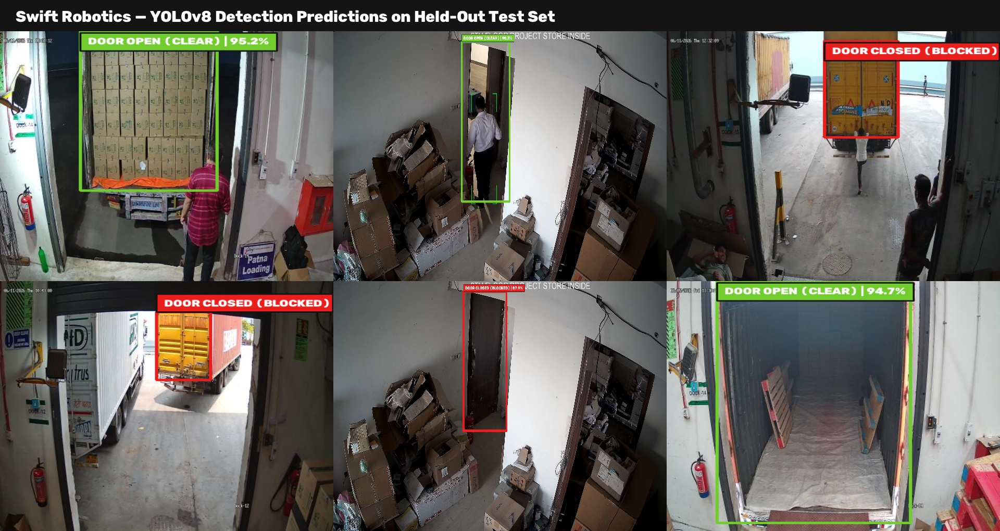

# Swift Robotics — Door Open / Closed Detection Pipeline
> **Perception Subsystem for Autonomous Mobile Robots (AMRs)**  
> **Candidate:** Saitejesh Tanuku | **Role:** Junior AI Engineer Technical Evaluation

[](https://www.python.org/)
[](https://pytorch.org/)
[](https://docs.ultralytics.com/)
[](https://onnx.ai/)
[](LICENSE)
[](https://creativecommons.org/licenses/by/4.0/)

---

## 1. Executive Summary

End-to-end computer vision pipeline to detect whether an architectural doorway is **`door_open`** (traversable) or **`door_closed`** (obstacle) for autonomous mobile robot navigation.

```
[Multi-Source Raw Data] ──► [aHash Dedup (-14.7%)] ──► [6 Controlled Experiments] ──► [Held-Out Test] ──► [ONNX Export]
      (2,512 images)              (2,143 clean)           (LR, Scale, Aug, Size)       (95.7% F1)          (CUDA / CPU)
```

**Key achievements:**
- **Deduplication:** Pruned 369 redundant CCTV burst frames (14.7%) via 256-bit aHash before dataset splitting to eliminate train/test data leakage.
- **Controlled ablations:** 6 experiments — 5 training runs isolating Learning Rate schedules, Model Capacity, Spatial Resolution, and Domain Augmentation, plus a post-hoc confidence threshold sweep.
- **Winning model (`lr_schedule`) on held-out test (N=281):** Precision 97.64%, Recall 93.87%, **F1 95.72%**, mAP@0.5 98.07%, mAP@0.5:0.95 84.52%.
- **Safety asymmetry audit:** Evaluated collision hazards (Closed→Open: 3.88%) vs fail-safe stops (Open→Closed: 2.25%) using ground-truth confusion matrix indexing.
- **Production ONNX model (`models/best.onnx`):** 3-tier validated and profiled on both CUDA (6.90 ms / ~145 FPS) and CPU (51.64 ms / ~19 FPS).

---

## 2. Dataset Preparation & Deduplication

Three public Roboflow sources were merged, polygon coordinates normalized to bounding boxes, and near-duplicates removed before splitting:

| Source | Raw Images | Retained | Pruned | Format Normalized | Visual Domain |
|---|---:|---:|---:|---|---|
| `vikashs_1527` | 1,527 | 1,522 | 5 | 10-pt Polygon → BBox | Residential and office room doorways |
| `fiw_706` | 691 | 327 | 364 | Bounding Box | Commercial warehouse, loading docks & storage corridor CCTV |
| `utfyu_116` | 294 | 294 | 0 | Bounding Box | Apartment hallways, mobile phone photos |
| **Total Canonical** | **2,512** | **2,143** | **369 (14.7%)** | 2 Classes | **1,541 Train / 321 Val / 281 Test** |

> **Domain & source notes:** `vikashs_1527`, `fiw_706`, and `utfyu_116` represent upstream Roboflow Universe dataset project identifiers; the Raw Images column indicates the actual annotated image count validated and ingested during pipeline preprocessing. Frames in `fiw_706` originate from overhead CCTV cameras in commercial facility storage rooms and loading dock hallways: because fixed-angle surveillance captures continuous video bursts at 30 FPS, removing 364 near-duplicate frames before dataset splitting was essential to prevent identical scenes from leaking across train and test sets.

> **Deterministic paths in `data/data.yaml`:** Dataset splits are declared as `../dataset/images/train`, `../dataset/images/val`, and `../dataset/images/test` relative to the `data/` folder, ensuring deterministic path resolution across different machines and clones without relying on global cache directories.

---

## 3. Hyperparameter Experiments & Validation Ablations

Five experiments evaluated on the **Validation Split (N=321)**, each changing exactly one factor group with all other parameters frozen:

| # | Experiment Name | Model Architecture | Resolution | Key Factor Tested | Precision | Recall | **F1 Score** | mAP@0.5 | **mAP@0.5:0.95** | Latency (ms) |
|---|---|---|---:|---|---:|---:|---:|---:|---:|---:|
| 1 | `baseline` | YOLOv8n (3.0M) | 640×640 | Reference (COCO defaults) | 0.9704 | 0.9690 | 0.9697 | 0.9757 | 0.8355 | 22.05 ms |
| 2 | `augmentation` | YOLOv8n (3.0M) | 640×640 | +HSV jitter, shear (2.0), mixup (0.1) | 0.9696 | 0.9645 | 0.9670 | 0.9846 | 0.8197 | 21.23 ms |
| 3 | `high_resolution`| YOLOv8n (3.0M) | 960×960 | Spatial scale 640→960px, batch 8 | 0.9791 | 0.9468 | 0.9627 | 0.9865 | 0.8327 | 26.56 ms |
| **4** | **`lr_schedule` 🏆** | **YOLOv8n (3.0M)** | **640×640** | **Cosine annealing floor `lrf` 0.01→0.001** | **0.9680** | **0.9738** | **0.9709** | **0.9806** | **0.8462** | **17.73 ms** |
| 5 | `model_size` | YOLOv8s (11.2M) | 640×640 | Higher model capacity (3.7× params) | 0.9800 | 0.9651 | 0.9725 | 0.9900 | 0.8455 | 18.80 ms |

> **Exp 6 — Confidence threshold sweep (post-hoc):** Sweeping `conf` from 0.10 to 0.60 showed peak F1 at `conf=0.25` (F1=0.9718). This threshold is applied during test inference.

---

## 4. Model Selection Rationale & Optimizer Dynamics

**Selected Winner: `lr_schedule` (Exp 4)**

Selection decision criteria:
1. **Real-Time Constraint:** Latency must be < 30 ms on edge hardware — all candidates passed.
2. **Strict Localization (mAP@0.5:0.95):** `lr_schedule` achieved the highest localization score (**0.8462**), outperforming both baseline (0.8355) and the 3.7× larger YOLOv8s (0.8455).
3. **F1 & Recall Balance:** Achieved **0.9709 F1** and the highest validation recall (**97.38%**), crucial for detecting traversable doors.
4. **Execution Speed:** Fastest PyTorch inference (**17.73 ms on val / 12.52 ms benchmark**).

**Technical Analysis of Optimizer & Learning Rate Dynamics:**
* When training with Ultralytics, `optimizer="auto"` determines optimizer and learning rate based on dataset size and iteration counts ($\text{iterations} = \lceil N_{\text{train}} / \max(B, 64) \rceil \times \text{epochs}$). For $N=1,541$ with 100 epochs (2,500 iterations), `auto` selects AdamW with $\text{lr} \approx 0.00167$.
* In `lr_schedule`, setting tighter cosine annealing floors (`lrf=0.001` vs baseline `lrf=0.01`) allowed the learning rate to decay to $1.8 \times 10^{-5}$ rather than leveling off at $3.3 \times 10^{-5}$. This finer late-epoch gradient refinement allowed the regression head to converge more tightly around doorframe boundaries without jitter, boosting strict localization (**0.8462 mAP@0.5:0.95**).
* `src/train.py` passes `optimizer = cfg.get("optimizer", "auto")` to Ultralytics. Only `lr_schedule` explicitly sets `optimizer: AdamW` in its config — all other experiments fall through to `"auto"`, which Ultralytics resolves to AdamW for this dataset size. This design means experiments without an explicit config key get framework-selected defaults, while `lr_schedule` gets full manual control over optimizer family.

---

## 5. Held-Out Test Results & Robotics Safety Analysis

The selected `lr_schedule` model was evaluated on the **Held-Out Test Set (N=281 images, 281 ground-truth instances)**:

$$\text{Precision: } \mathbf{97.64\%} \quad|\quad \text{Recall: } \mathbf{93.87\%} \quad|\quad \mathbf{F_1\text{ Score: }} \mathbf{0.9572} \quad|\quad \text{mAP@0.5: } \mathbf{98.07\%} \quad|\quad \text{mAP@0.5:0.95: } \mathbf{84.52\%}$$

### Per-Class Performance Breakdown

| Class | Precision | Recall | F1 Score | mAP@0.5 | mAP@0.5:0.95 | Ground Truth Instances |
|---|---:|---:|---:|---:|---:|---:|
| `door_open` | **100.00%** | **93.57%** | **0.9668** | **97.32%** | **85.36%** | 178 |
| `door_closed` | **95.27%** | **94.17%** | **0.9472** | **98.82%** | **83.67%** | 103 |
| **All Classes** | **97.64%** | **93.87%** | **0.9572** | **98.07%** | **84.52%** | **281** |

*Logged in `results/test_class_metrics.json` and `results/metrics_lr_schedule_test.json`.*

### Confusion Matrix & Safety Asymmetry

```
                 Predicted Open    Predicted Closed    Missed (Background)    Total Actual
Actual Open            167                 4                    7                 178
Actual Closed            4                98                    1                 103
```

> **Robotics Safety Asymmetry Audit:**
> * **False Traversability Hazard (Actual Closed → Predicted Open):** Occurred in **4 out of 103 closed doors (3.88%)**. Predicting a closed door as open creates a collision hazard. In deployment, a 3-frame temporal consensus filter requires 3 consecutive agreeing detections before clear footprint commands are dispatched to Nav2.
> * **Fail-Safe Pause (Actual Open → Predicted Closed):** Occurred in **4 out of 178 open doors (2.25%)**. This error causes the robot to momentarily pause or re-route, representing a safe failure mode.
> * **Missed Detections (Background):** 7 open doors (3.93%) and 1 closed door (0.97%) had no overlapping prediction above threshold.

---

## 6. Example Predictions

Detections generated directly from the winning `lr_schedule` model on held-out test scenes across residential, office, and commercial environments:



- **Green badge** = `door_open` (traversable)
- **Red badge** = `door_closed` (obstacle)

---

## 7. Production ONNX Export & Multi-Runtime Benchmark

The winning model was exported to **ONNX (Opset 12)** and verified with `onnx.checker` topology validation, zero-crash session execution, and PyTorch numerical output parity:

```bash
python src/export_onnx.py --weights runs/detect/lr_schedule/weights/best.pt --imgsz 640 --opset 12
```

### Hardware Latency Profiling (100 Iterations, 10 Warmup)

| Model Variant / Runtime | Execution Provider / Device | Mean Latency | Median (P50) | 95th %ile (P95) | Throughput | Artifact Log |
|---|---|---:|---:|---:|---:|---|
| **ONNX Runtime (CUDA EP)** | NVIDIA RTX 3050 Laptop GPU | **6.90 ms** | 6.77 ms | 7.96 ms | **~144.9 FPS** | `results/benchmark_best_onnx_cuda.json` |
| **PyTorch FP16 (CUDA)** | NVIDIA RTX 3050 Laptop GPU | **12.52 ms** | 11.22 ms | 18.58 ms | **~79.9 FPS** | `results/benchmark_lr_schedule.json` |
| **ONNX Runtime (CPU EP)** | Host Intel CPU (Fallback) | **51.64 ms** | 48.17 ms | 78.68 ms | **~19.4 FPS** | `results/benchmark_best_onnx_cpu.json` |

---

## 8. Failure Modes & Mitigations

| Failure Mode | Visual Signature | Root Cause | Engineering Mitigation |
|---|---|---|---|
| **Low Contrast / Glare** | Missed closed door in dim hallway | Door panel blends with frame | Contrast-adaptive histogram equalization |
| **Partial Occlusion** | Broken detection box | Carts/people block door edges | Cutout & synthetic foreground occlusion training |
| **Glass / Specular Reflection** | Closed glass door misidentified | Frame-only visual feature ambiguity | Cross-validate with 2D LiDAR / depth point cloud |
| **Ajar Door (5°–15°)** | Ambiguous state | Narrow visual opening gap | Calculate metric aperture width via RGB-D sensor |
| **Small / Distant Door (>10m)** | Low confidence score | Bounding box occupies <2% of sensor | Adaptive Region-of-Interest (ROI) digital crop |

---

## 9. Reproduction & Quick-Start Guide

```bash
git clone https://github.com/tanukusaitejesh-prog/YOLO-TASK.git
cd YOLO-TASK
pip install -r requirements.txt

# 1. Train winning lr_schedule model
python src/train.py --experiment lr_schedule

# 2. Evaluate on test split (saves full per-class metrics & confusion matrix)
python src/evaluate.py --weights runs/detect/lr_schedule/weights/best.pt --split test --imgsz 640

# 3. Export to ONNX (Opset 12)
python src/export_onnx.py --weights runs/detect/lr_schedule/weights/best.pt --imgsz 640 --opset 12

# 4. Profile latency on CUDA and CPU
python src/benchmark.py --weights models/best.onnx --model-type onnx --device cuda --imgsz 640 --name best_onnx_cuda
python src/benchmark.py --weights models/best.onnx --model-type onnx --device cpu --imgsz 640 --name best_onnx_cpu
```
